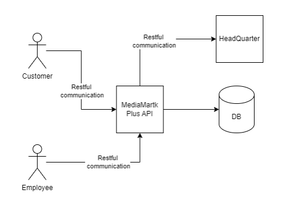

# Sūpāmāketto Kata

## Introduction 

In the new way Coding Dojo we aim to not only cover the basics and small examples but also a real project. What I have prepared is an extension to the supermarket kata.  

## How it works? 

We provide the developers with the TTD knowledge and now it is team to simulate the real life project and how to tackle a project by following TDD. In all sessions we will start with reading the User stories and comprehend them. If it is needed or if they have any ambiguity they have to ask it from the sensei. In the Coding Dojo sensei has the role of PO as well. 

1 .In this katas we are not just practicing TDD, we try to Making the stories as clear as possible and following SOLID principles  

## Project Definition and user stories 

We are trying to build an online store called MediaMarktPlus.   

#### Roles 

- Customer: the end user who use this system to buy electronics. For this sprint we assume we will have just one customer. 

- Employee: people who work for MediaMarktplus, for this sprint Authentication and Authorization is not needed 

#### Project Architecture: 



## User Stories 

### User story 1

The users should be able to get the products information by calling an API endpoint. 

The request should be a Get Method with no parameter and should return a list of products. 

response:
```json
{ 
    "status": string = "success"/"error",
    "message": string = "" on success, error_message on error.
    "result": [
        { 
            "product_id": int, 
            "name": string, 
            "price": float, 
            "description": string, 
            "is_available": bool 
        }, 
        ... 
    ]
} 
```
- when the database is empty the result list is also empty
- when the database has products then result list should not be empty

### User story 2: 

Customers should be able to send a request to the server and add an item to cart. 

Customer should send the `product_id:int` and `quantity:int` to the endpoint and will get `true`/`false` from server.

### User story 3: 

Customers should be able to remove an item from the cart and get `true`/`false` from server as response.

### User story 4: 

Customers should be able to get the list of items he has in the cart. 

response: 
```json
{ 
    "status": string = "success"/"error",
    "message": string = "" on success, error message on error.
    "result": { 
        "total_price": float,
        "total_quantity": int,
        "products": [
            { 
                "product_id": int, 
                "name": string,
                "quantity": int, 
                "total_price": float 
            },
            ... 
        ]
    }
}
```

### User story 5: 

Customers should be able to request an order to buy all the item. System should check if all items exist in the store first and then process the request. No Payment needed for this sprint. On success the cart should be emptied. 

response: 
```json
{ 
    "status": string = "success"/"error",
    "message": string = "" on success, error message on error.
    "result": { 
        "total_price": float,
        "total_quantity": int,
        "products": [
            { 
                "product_id": int, 
                "name": string,
                "quantity": int, 
                "total_price": float 
            },
            ... 
        ]
    }
}
```

### User story 6: 

After processing an order, System should automatically send a request to the Company if any item’s quantity goes bellow a threshold.

### User story 7: 

Employees should be able to Add/Edit products. The products should have a threshold for ordering automatically. If the `quantity` of a product goes below the threshold system should send a rest request to server to order.

suggested end point names: 

- https://example.com/api/ItemManagement/Add
- https://example.com/api/ItemManagement/edit
- https://example.com/api/ItemManagement/List
- https://example.com/api/product/List
- https://example.com/api/Cart/Add
- https://example.com/api/Cart/Remove/{Id}
- https://example.com/api/Cart/List
- https://example.com/api/Order/Confirm

## Plan For Sessions 

### Session 0 

As Bart suggested it would be nice to have a preparation session before the first session to check the connectivity, development environment, etc. 

### Session 1 

Talking about the basics of Coding dojo, and TDD. Then start with Stake kata. 

### Session 2 

Start working on the project and setup the project structure.  

Read the user stories and change the order.  

1. ItemManagement endpoints 
2. Product Endpoint 
3. Cart Endpoint 
4. Order Endpoint 

Start developing ItemManagement, save and edit files from an static object. 

### Session 3 

Start with Explaining how to Mock against ORMs. 

Change the static object to ORM. 

Complete the development of ItemManagement and Product endpoint if it is possible. 

### Session 4 

Continue working on the Cart endpoint. 

Think about the options how to Mock Http clients and try to continue with the code.

### Session 5 

Complete the project and do the refactoring. 

### Session 6 

Create a service layer and move the code from the controller to the service layer. 

### Session 7 

Cover mutation testing and write one Integration testing using in memory hosts such as WebApplicationFactory 

 